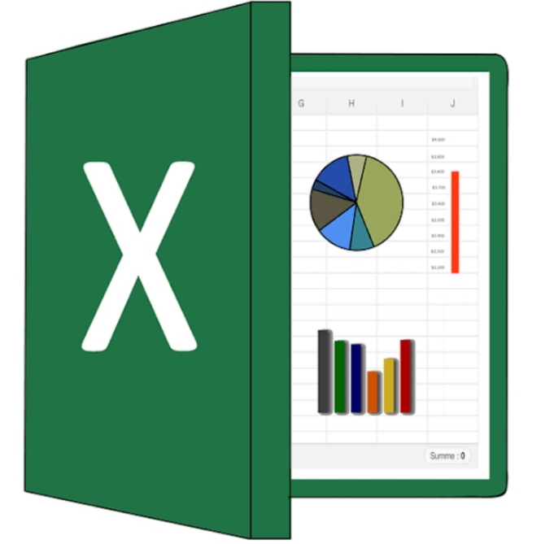
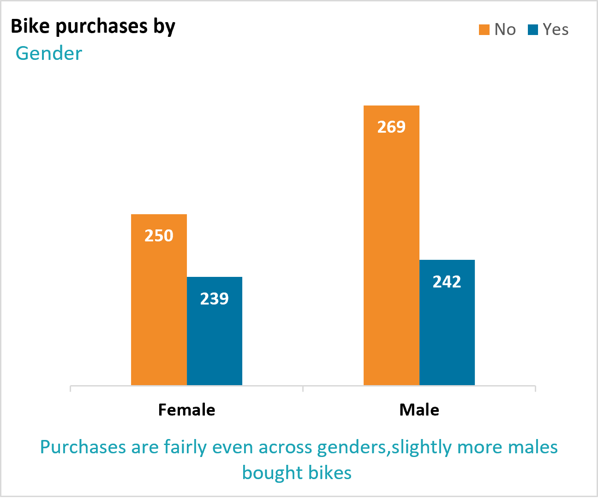
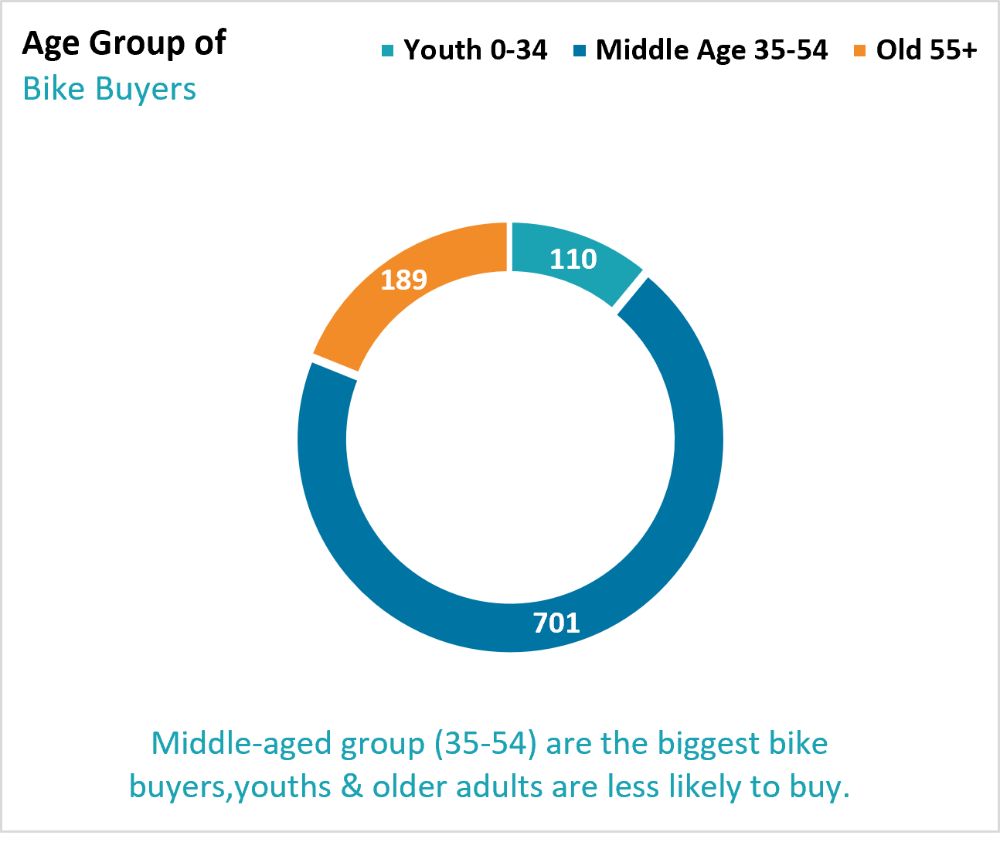
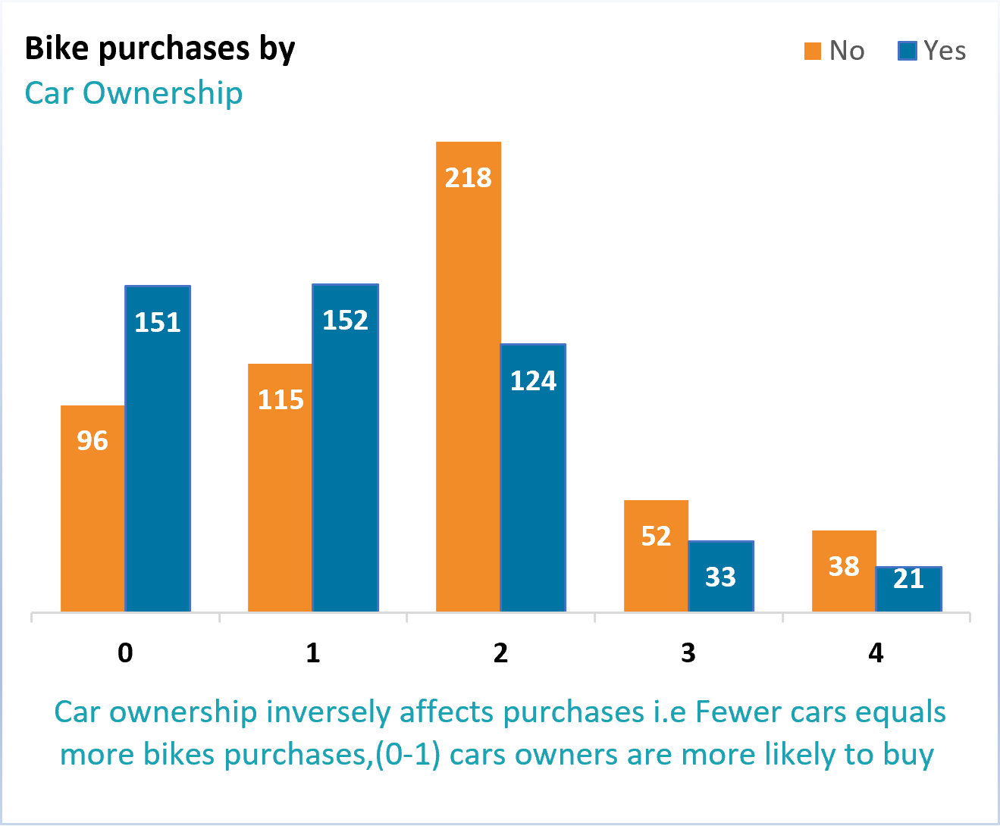
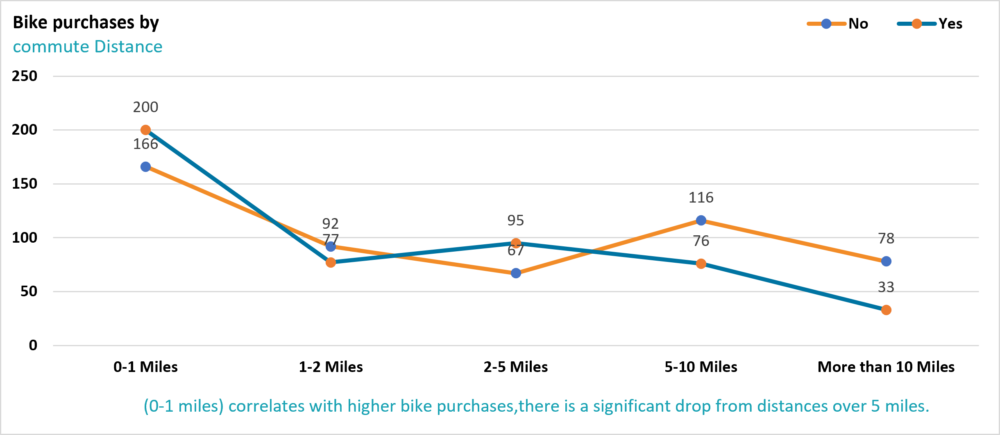
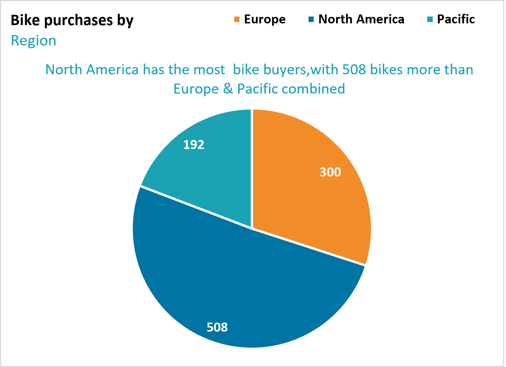

# 2025-Bike-Sales-Dashboard-
This repository contains an Excel dashboard that visualizes bike sales data for 2025.

## KPI'S
- **Total Customers**: 1000
- **Total Bike Sales**: 481
- **Bike Purchase Rate**: 48%
- **Average Age of Buyers**: 43 years
- **Average Income per Buyer**: $57,963

## Dashboard Preview:

## Tools Used:
- Microsoft Excel
- Pivot Tables
- Bar Charts,
- Pie Charts,
- Lines Charts and
- Slicers

## Notes:
This dashboard highlights trends in

- Bike purchases based on gender,
- Age groups,
- Car ownership,
- Commute distance and
- Region.

## Key insights
### Bike Purchases by Gender

- Purchases are slightly more even across gender, slightly more males bought bikes as expected.

  ### Bike purchases by Age Group
  
- Middle-aged group (35-54) are the biggest bike buyers, Youths and older adults are less likely to buy.

  ### Bike purchases by Cars Ownership
  
- There is an inverse relationship between car ownership and Bike purchases i.e Fewer Cars = more bike purchases and vice versa.(0-1) Car owners are more likely to buy bikes.

### Bike Purchases by Commute Distance

- (0-1 miles) correlates with higher bike purchases,indicating that shorter distances and people living closer to work are more likely to purchase bikes.

### Bike purchases by Region

- With 508 bike buyers, North America has the most buyers than Europe's (300) and pacific's (192) combine.

