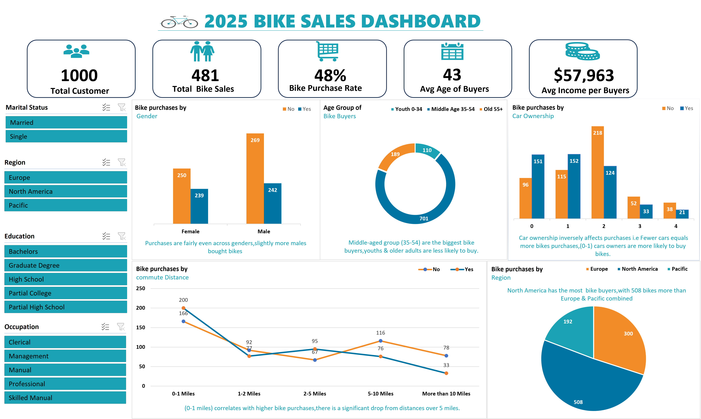

# 2025-Bike-Sales-Dashboard-
This repository contains an Excel dashboard that visualizes bike sales data for 2025.

## KPI'S
- **Total Customers**: 1000
- **Total Bike Sales**: 481
- **Bike Purchase Rate**: 48%
- **Average Age of Buyers**: 43 years
- **Average Income per Buyer**: $57,963

## Dashboard Preview:

## Tools Used:
- Microsoft Excel
- Pivot Tables
- Bar Charts,
- Pie Charts,
- Lines Charts and
- Slicers

## Notes:
This dashboard highlights trends in -Bike purchases based on gender,
-Car Ownership,
-Age group, and
-Region.

## Key insights
- Purchases are slightly more even across gender, slightly more males bought bikes as expected.
- Middle-aged group (35-54) are the biggest bike buyers, Youths and older adults are less likely to buy.
- There is an inverse relationship between car ownership and Bike purchases i.e Fewer Cars = more bike purchases vice versa.(0-1) Car owners are more likely to buy bikes.
- (0-1 miles) correlates with higher bike purchases,indicating that the shorter distances or people living closer to work are more likely to purchase bikes
- With 508 bike buyers, North America has the most buyers than Europe's (300) and pacific's (192) combine.

